<div align="center">
  <!-- TODO: add actual logo file at docs/assets/logo.png before publishing; image will 404 until then -->
  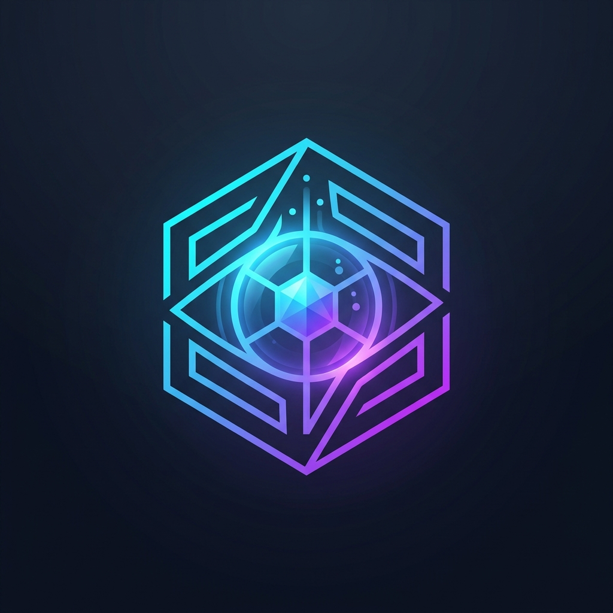
  <h1>ForgeLens</h1>
  <p><strong>Deterministic Engineering Intelligence.</strong></p>
  
  [](https://github.com/voidswift/Forge-Lens/actions)
  [](https://codecov.io/gh/voidswift/Forge-Lens)
  [](https://opensource.org/licenses/MIT)
  []()
  
  <br />
</div>

ForgeLens provides engineering leadership with deterministic visibility into codebase health and velocity, utilizing robust background reconciliation and selective semantic AI analysis.


---

## 1. Table of Contents

1. [Vision](#2-vision)
2. [Product Overview](#3-product-overview)
3. [Architecture Overview](#4-architecture-overview)
4. [User Journey](#5-user-journey)
5. [System Flow](#6-system-flow)
6. [Data Flow](#7-data-flow)
7. [Database](#8-database)
8. [API](#9-api)
9. [Dashboard](#10-dashboard)
10. [Design System](#11-design-system)
11. [AI Architecture](#12-ai-architecture)
12. [GitHub Integration](#13-github-integration)
13. [Security](#14-security)
14. [Performance](#15-performance)
15. [Folder Structure](#16-folder-structure)
16. [Development Workflow](#17-development-workflow)
17. [Deployment](#18-deployment)
18. [Monitoring](#19-monitoring)
19. [Testing](#20-testing)
20. [Roadmap](#21-roadmap)
21. [Business Model](#22-business-model)
22. [Contributing](#23-contributing)
23. [FAQ](#24-faq)
24. [Glossary](#25-glossary)
25. [References](#26-references)
26. [License](#27-license)

---

## 2. Vision

### Why ForgeLens Exists
Engineering leadership lacks visibility into the granular health of their repositories. Existing tools rely on vanity metrics (lines of code) or invasive surveillance (time-tracking). ForgeLens exists to surface structural codebase health through deterministic Git metadata.

### Problem
Organizations cannot quantify technical debt accumulation or review bottlenecks without manual audits, leading to delayed releases and developer burnout.

### Solution
An event-driven intelligence platform that ingests GitHub data via durable queues, aggregates metrics using Postgres Materialized Views, and utilizes LLMs strictly for semantic clustering of pull requests.

### Mission
Replace engineering intuition with evidence.

### Goals
- Process 100,000+ commit repositories without ingestion timeouts.
- Serve dashboard analytics in < 50ms.
- Guarantee 100% data consistency via cron reconciliation.

### Non-Goals
- Individual developer surveillance or stack-ranking.
- Predictive burnout analysis (HR risk).
- CI/CD pipeline execution.

### Engineering Philosophy
Boring technology scales. We prefer Postgres Materialized Views over Kafka for MVP. We prefer durable execution (Inngest) over complex microservices. We isolate business logic from presentation frameworks.

---

## 3. Product Overview

### Features and Workflows

#### Guest Mode
Unauthenticated users view public repository metrics. The system serves these requests from edge caches, restricting historical depth to 30 days to prevent abuse.

#### Repository Dashboard
The primary view for a specific repository. Displays the 4-card metric grid (Velocity, Open PRs, Merged PRs, Contributors) powered by pre-aggregated database views. 

#### Workspace
The authenticated landing page. Lists all tracked repositories for the tenant. Enables triggering asynchronous synchronization via the `syncRepositories` action.

#### Insights
The semantic AI dashboard. Users request an analysis of a time range. The system queries the `domain-analytics` package for raw commits/PRs, feeds them to the `@forgelens/ai` package, and streams a Markdown report detailing architectural themes and technical debt patterns.

#### Alerts
Configurable thresholds (e.g., "PR merge time > 48 hours"). Evaluated asynchronously during the nightly reconciliation cron.

#### Reports
PDF exports of weekly velocity metrics generated via Puppeteer in a background worker.

#### Contributors
Leaderboards based on PR velocity and review participation. Ranked deterministically via SQL dense_rank functions.

---

## 4. Architecture Overview

ForgeLens uses a strictly enforced Modular Monolith architecture.

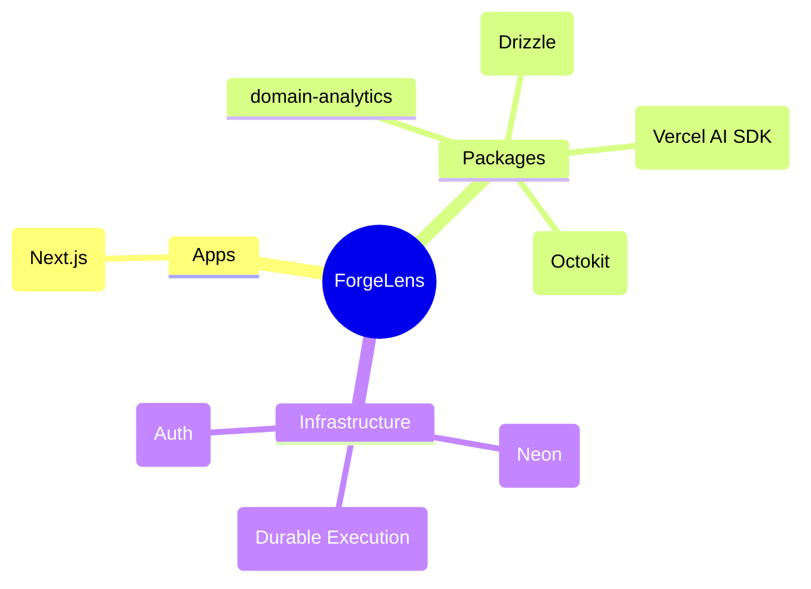

### Layered Architecture
- **Presentation:** `apps/web` handles routing, JSX rendering, and request validation.
- **Domain:** `packages/domain-*` contains pure TypeScript business rules.
- **Infrastructure:** `packages/db`, `packages/github` handle I/O and external provider contracts.

### Background Workers
Long-running tasks (initial sync, webhook processing, nightly reconciliation) are offloaded to Inngest to bypass Serverless execution limits.

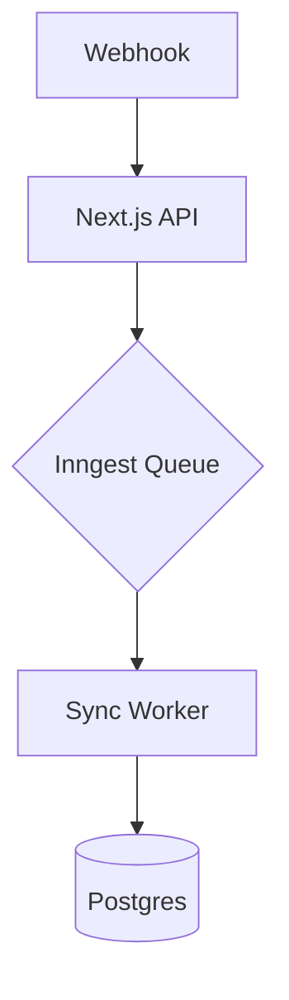

---

## 5. User Journey

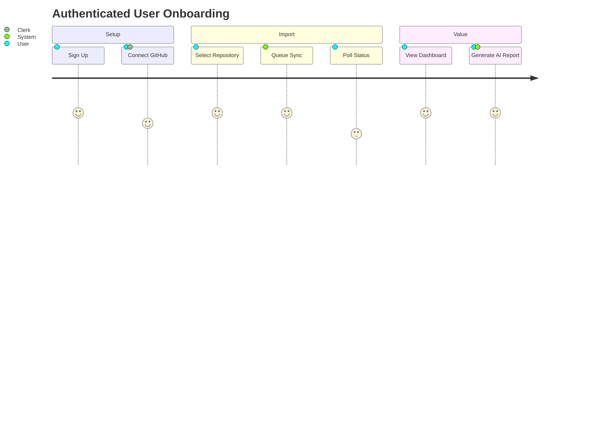

---

## 6. System Flow

### Repository Import Sequence

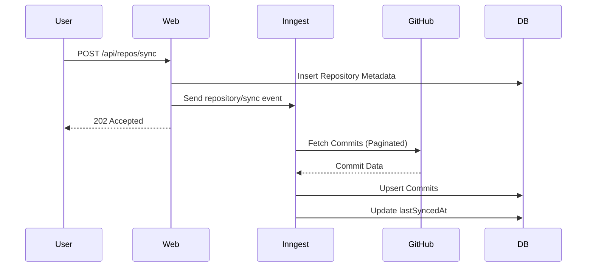

### AI Report State Machine

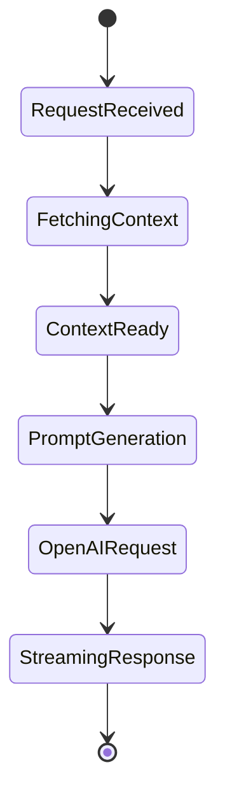

---

## 7. Data Flow

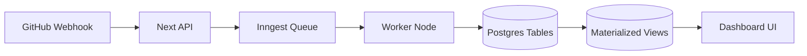

Data flows unidirectionally from external providers into the durable queue, is written to append-heavy tables (`commits`, `pull_requests`), and is periodically aggregated into Materialized Views for rapid read operations.

---

## 8. Database

We utilize Postgres via Drizzle ORM. 

### Entity Relationship Diagram

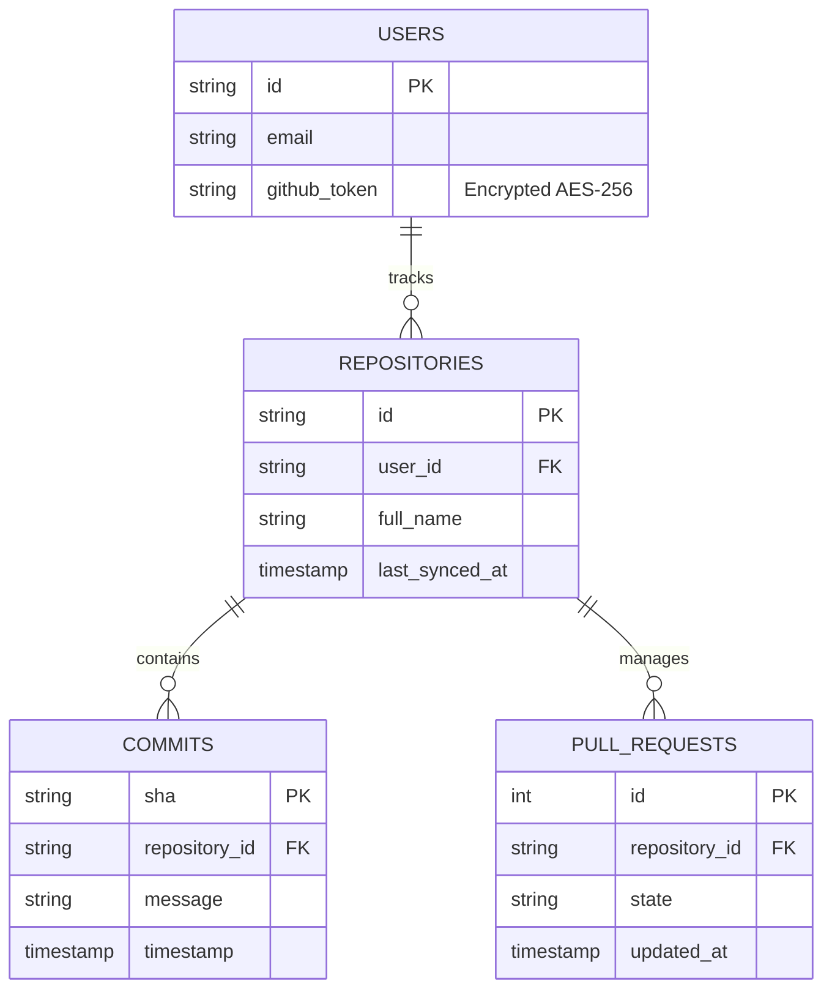

### Constraints and Security
- **Foreign Keys:** Cascading deletes ensure orphan records are destroyed if a repository is untracked.
- **Indexes:** Composite indexes on `(repository_id, timestamp)` and `(repository_id, state)` prevent full table scans.
- **Encryption:** `github_token` utilizes a Drizzle custom type for AES-256-GCM encryption at rest.

---

## 9. API

### Contracts

#### `POST /api/webhooks/github`
Receives GitHub payload. Validates HMAC-SHA256 signature natively via Node `crypto`. Responds `202 Accepted` and delegates payload to Inngest.

#### `GET /api/repos/:id/analytics`
Fetches pre-aggregated metrics.
- **Rate Limit:** 100 req/min per IP.
- **Response:**
```json
{
  "totalCommits7d": 142,
  "openPrs": 12,
  "closedPrs": 89
}
```

---

## 10. Dashboard

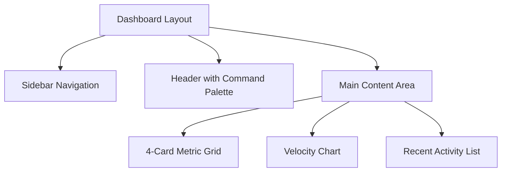

The UI is built with Tailwind CSS, strictly adhering to mobile-first responsive design. The command palette (Ctrl+K) provides global navigation.

---

## 11. Design System

- **Typography:** Inter (Sans), JetBrains Mono (Code).
- **Spacing:** Tailwind default 4px scale.
- **Tokens:** Centralized in `tailwind.config.ts`.
- **Accessibility:** WCAG 2.1 AA compliant contrast ratios. Radix UI primitives for complex components (dialogs, dropdowns).

---

## 12. AI Architecture

```mermaid
graph TD
    A[User Request] --> B[Domain Analytics]
    B --> C[Fetch Raw Commits/PRs]
    C --> D[@forgelens/ai Package]
    D --> E[Prompt Construction]
    E --> F[OpenAI gpt-4o]
    F --> G[Markdown Stream]
```

AI is strictly utilized for **Semantic Code Review**. We do not use AI for deterministic math. The pipeline fetches the last 14 days of commit messages, constructs a highly specific context window, and requests an analysis of architectural themes and technical debt.

---

## 13. GitHub Integration

We integrate via GitHub Apps and OAuth.
- **Authentication:** Managed via Clerk OAuth providers.
- **Rate Limits:** Octokit is configured with exponential backoff retries within the durable Inngest worker.
- **Reconciliation:** A nightly cron (`0 0 * * *`) scans active repositories, verifies `last_synced_at`, and triggers delta syncs to heal dropped webhooks.

---

## 14. Security

- **Encryption:** OAuth tokens encrypted via AES-256-GCM in the DB layer.
- **Authentication:** Clerk manages JWTs and session lifecycle.
- **Webhooks:** Validated via HMAC signatures. Replay attacks mitigated by validating `x-github-delivery` headers against a Redis cache.
- **Tenant Isolation:** Drizzle queries strictly enforce `where(eq(repositories.userId, currentUserId))`.
- **Compliance:** Architecture is designed for SOC2 Type I readiness (encryption at rest, audit logs via Inngest step histories).

---

## 15. Performance

- **Target:** Dashboard TTI < 100ms.
- **Bottlenecks Mitigated:**
  - Vercel 30s timeouts resolved via Inngest queues.
  - Postgres analytical queries resolved via Materialized Views and composite indexing.
  - LLM latency masked via React Server Components streaming (`Suspense`).

---

## 16. Folder Structure

```text
forgelens/
├── apps/
│   └── web/                 # Next.js Application
│       ├── src/app/         # App Router (Pages, API)
│       ├── src/actions/     # Server Actions
│       └── src/inngest/     # Durable Worker Functions
├── packages/
│   ├── ai/                  # AI Wrapper (Vercel AI SDK)
│   ├── db/                  # Drizzle ORM, Schemas, Encryption
│   ├── domain-analytics/    # Pure TypeScript Business Logic
│   └── github/              # Octokit Provider Abstraction
├── pnpm-workspace.yaml
└── turbo.json
```

**Dependency Rule:** `packages/domain-*` cannot import from `apps/*`. Infrastructure packages (`db`, `github`) cannot depend on each other.

---

## 17. Development Workflow

- **Branching:** Trunk-based development.
- **Commits:** Conventional Commits (`feat:`, `fix:`, `chore:`).
- **CI:** GitHub Actions runs `turbo build`, `eslint`, and `vitest`.
- **Preview:** Vercel automatically deploys branch previews for every PR.

---

## 18. Deployment

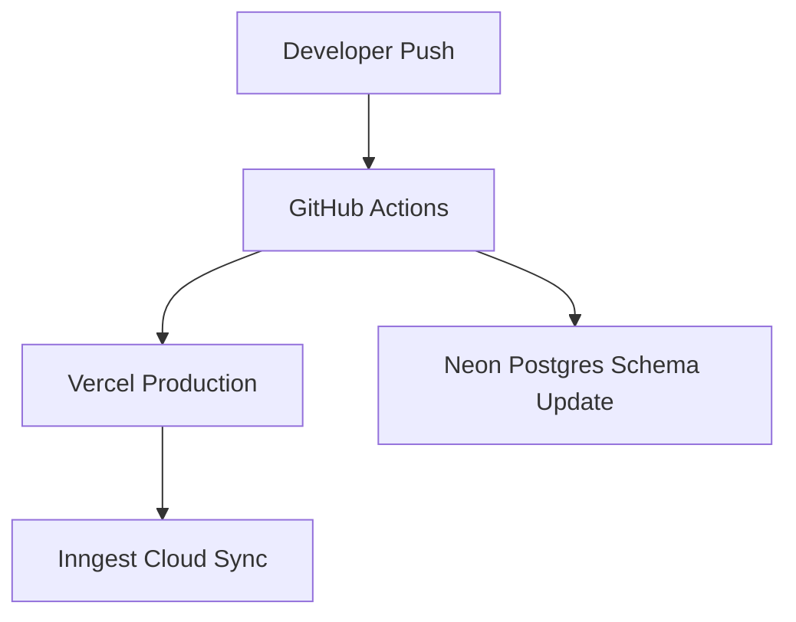

---

## 19. Monitoring

- **Logging:** Structured JSON logs sent to Axiom.
- **Tracing:** Next.js OpenTelemetry instrumentation.
- **Error Tracking:** Sentry captures unhandled exceptions in API routes and Inngest workers.
- **SLOs:** 99.9% uptime for dashboard reads. 99.9% webhook ingestion success (post-reconciliation).

---

## 20. Testing

- **Unit:** Vitest for pure functions in `packages/domain-analytics`.
- **Integration:** Testcontainers for Postgres DB schema tests.
- **E2E:** Playwright for critical user journeys (OAuth login -> Repo Sync).

---

## 21. Roadmap

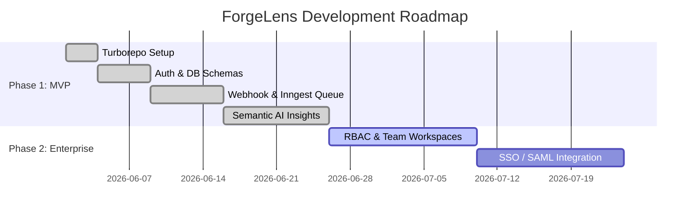

---

## 22. Business Model

- **Free Tier:** 1 public repository, 30 days retention.
- **Pro ($20/mo):** Unlimited private repositories, 1 year retention, semantic AI insights.
- **Enterprise ($499/mo):** SAML SSO, on-premise runner support, raw data export, audit logs.

---

## 23. Contributing

1. Fork the repository.
2. Create a feature branch (`git checkout -b feat/add-alerts`).
3. Ensure tests pass (`pnpm test`).
4. Submit a PR targeting `main`.

---

## 24. FAQ

**Q: Why not microservices?**
A: A modular monolith provides the internal boundaries of microservices without the DevOps overhead of maintaining Kubernetes, gRPC, and distributed tracing during the MVP phase.

**Q: Is my code sent to OpenAI?**
A: Only commit messages, PR titles, and author names are sent to the LLM. Source code is never read or transmitted.

---

## 25. Glossary

- **Durable Execution:** A system that guarantees code runs to completion by maintaining state across retries (Inngest).
- **CQRS-lite:** Separating rapid database writes (webhooks) from optimized analytical reads (Materialized Views).
- **Semantic Code Review:** AI analysis of architectural intent rather than line-by-line syntax validation.

---

## 26. References

- [Next.js Documentation](https://nextjs.org/docs)
- [Inngest Documentation](https://www.inngest.com/docs)
- [Drizzle ORM](https://orm.drizzle.team/)
- [Vercel AI SDK](https://sdk.vercel.ai/docs)
- [GitHub Webhooks](https://docs.github.com/en/webhooks)

---

## 27. License

Copyright © 2026 VoidSwift. Licensed under the MIT License.
