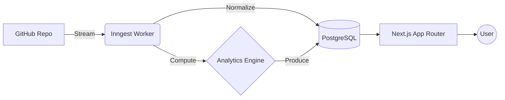
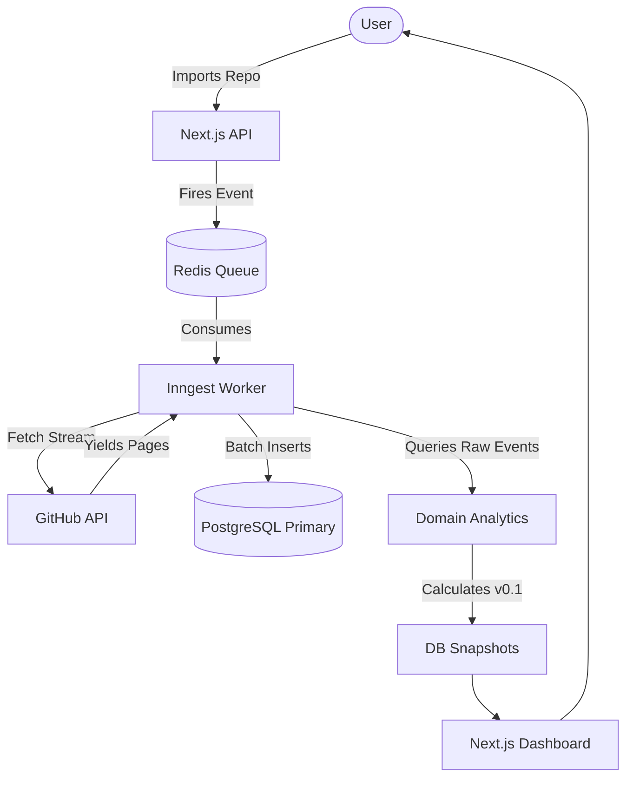
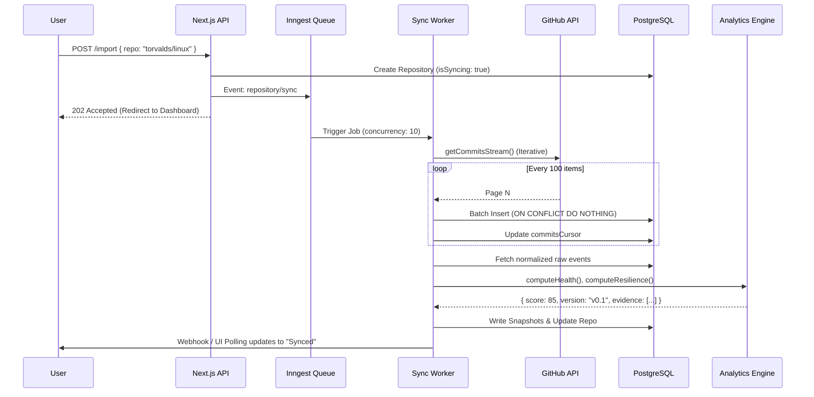
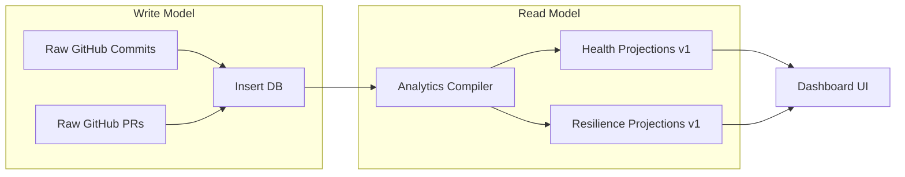

<p align="center">
  
</p>

<h1 align="center">ForgeLens</h1>

<p align="center">
  <strong>The Deterministic Repository Intelligence & Analytics Engine.</strong><br/>
  <em>Understand the true health, resilience, and operational reality of any codebase in under 60 seconds.</em>
</p>

<p align="center">
  <a href="#status"></a>
  <a href="#license"></a>
  <a href="#architecture"></a>
  <a href="#benchmarks"></a>
  <a href="#stack"></a>
</p>

---

## 📸 Demo

*(Note: UI assets are populated during the Beta phase)*

**Dashboard Preview**  
A real-time overview of your imported repositories, displaying aggregated Health and Resilience scores.

**Timeline Preview**  
The raw event stream showing GitHub commits, pull requests, and ingestion checkpoints.

**Architecture Preview**  


---

## 📑 Table of Contents

1. [What is ForgeLens?](#what-is-forgelens)
2. [Why ForgeLens Exists](#why-forgelens-exists)
3. [Core Principles](#core-principles)
4. [Features](#features)
5. [Repository Architecture](#repository-architecture)
6. [System Architecture](#system-architecture)
7. [Request Lifecycle](#request-lifecycle)
8. [Data Flow](#data-flow)
9. [Sync Engine](#sync-engine)
10. [Analytics Engine](#analytics-engine)
11. [AI Architecture](#ai-architecture)
12. [Database](#database)
13. [Security](#security)
14. [Performance](#performance)
15. [Testing](#testing)
16. [DevOps](#devops)
17. [Project Structure](#project-structure)
18. [Technology Stack](#technology-stack)
19. [Engineering Decisions](#engineering-decisions)
20. [API](#api)
21. [GitHub Integration](#github-integration)
22. [Benchmarks](#benchmarks)
23. [Documentation](#documentation)
24. [ForgeLens Labs](#forgelens-labs)
25. [Roadmap](#roadmap)
26. [Known Limitations](#known-limitations)
27. [FAQ](#faq)
28. [Contributing](#contributing)
29. [License](#license)
30. [Acknowledgements](#acknowledgements)
31. [Final Engineering Statement](#final-engineering-statement)

---

## 🔍 What is ForgeLens?

### The Problem
GitHub tells you what happened. It tells you who committed code, when a PR was merged, and how many stars a project has. It does **not** tell you if the project is healthy, if the maintainers are burning out, or if the repository is entirely dependent on a single developer who hasn't logged in for 90 days. 

### The Vision
To build a deterministic, explainable analytics engine that translates raw version control events into actionable operational intelligence.

### The Mission
Give Engineering Managers, Open Source Maintainers, and Tech Leads the ability to measure the exact resilience of a codebase before adopting it into production. 

### Target Users
- **Engineering Managers:** Identifying bus factors and burnout in internal teams.
- **OSS Maintainers:** Tracking community health and contributor pipelines.
- **Enterprise Architects:** Vetting open-source dependencies for long-term viability.

### Non-Goals
- We are not a CI/CD platform.
- We are not a project management tool (Jira/Linear).
- We do not use AI to "guess" health scores. Magic is prohibited in the core engine.

---

## ❓ Why ForgeLens Exists

### The History and Pain Points
Historically, evaluating a repository meant manually scanning contributor graphs, checking the date of the last merged PR, and hoping the primary author wouldn't abandon the project. Existing solutions either focus purely on vanity metrics (stars, forks) or employ black-box AI that hallucinates "sentiment" without providing cryptographic proof of the calculation.

### Why ForgeLens is Different
ForgeLens treats repository metadata as a continuous, append-only event stream. We don't summarize data; we compile it. Every score—Health, Bus Factor, Resilience—is backed by deterministic evidence strings that point directly to the raw data. If ForgeLens says a repository has a Bus Factor of 1, it will tell you exactly *who* that person is and *why* their absence would freeze the project.

---

## ⚖️ Core Principles

ForgeLens is governed by strict engineering philosophies:

1. **Evidence over Intuition:** Every metric must be mathematically provable.
2. **LLMs Never Compute Truth:** AI is for querying and summarization (TCGE Labs), never for generating core analytics or health scores.
3. **Constant-Memory Ingestion:** Systems must scale to `torvalds/linux` without Out-Of-Memory (OOM) kills. We stream, normalize, persist, and discard.
4. **Idempotency is Mandatory:** If a worker dies, it resumes from a cursor. It never restarts from zero.
5. **Back-Pressure:** The queue yields to the database. We do not DDOS our own infrastructure.
6. **Zero-Downtime Projections (CQRS-lite):** Analytics algorithms are versioned. Migrations are non-destructive replays.
7. **Performance Budgets:** CI fails if Node memory exceeds 500MB or queue latency exceeds 5 seconds.
8. **Docs as Code:** Architecture is strictly tracked in ADRs. Failure is tracked in Blameless Postmortems.

---

## ✨ Features

### Current (Beta)
- **Repository Import:** Stream-based ingestion of GitHub commits and PRs.
- **Health Engine:** Deterministic scoring across Velocity, Activity, Responsiveness, and Maintenance.
- **Resilience Engine:** Operational risk scoring including Bus Factor, Knowledge Distribution, Review Coverage, and Contributor Freshness.
- **Contributor Intelligence:** Automated classification of core maintainers, flight risks, and domain experts.
- **Historical Snapshots:** Time-series tracking of repository health.
- **Debug Console:** Hidden admin view for tracking ingestion cursors, rate-limits, and memory pressure.

### Future / Experimental (Labs)
- **Temporal Code Graph Engine (TCGE):** A multi-dimensional AST database tracking how code relationships evolve over time.
- **AI Query Gateway:** Natural language interfaces to interrogate the TCGE (e.g., "When did we introduce the memory leak in the billing module?").
- **Slack / GitLab Integrations:** Multi-provider ingestion streams.

---

## 📂 Repository Architecture

ForgeLens is a strict Monorepo powered by Turborepo and PNPM workspaces.

```text
Forge-Lens/
├── apps/
│   └── web/                 # Next.js 14 App Router, UI, Server Actions, Inngest Workers
├── packages/
│   ├── db/                  # PostgreSQL schema, Drizzle ORM, Migrations
│   ├── domain-analytics/    # Pure TS algorithms (Health, Resilience, Contributors)
│   ├── github/              # Streaming Octokit client, Rate limit throttler
│   ├── ui/                  # Shared React components, Tailwind config
│   └── config/              # Shared ESLint, TSConfig settings
├── benchmark/               # Operational V8 traces and historical JSON performance
├── docs/                    # ADRs, Postmortems, Release Gates, Product Truth
└── .github/                 # Actions, Strict PR Templates
```

### Bounded Contexts
- `apps/web` handles **transport** (HTTP, UI, Jobs).
- `packages/db` handles **persistence**.
- `packages/domain-analytics` handles **business logic**. It is strictly decoupled from the database and the UI. It accepts plain JSON objects and returns deterministic scores.

---

## 🏛️ System Architecture

ForgeLens is built on an Event-Driven, CQRS-lite architecture.



### Flow Breakdown
1. **Frontend:** React Server Components (RSC) query read-only PostgreSQL projections.
2. **Backend:** Next.js Server Actions validate input via Zod and dispatch events to Inngest.
3. **Workers:** Serverless functions that orchestrate streaming ingestion, applying Octokit backoff on 429s.
4. **Database:** Drizzle ORM on PostgreSQL, heavily indexed on `repositoryId`.

---

## 🔄 Request Lifecycle

When a user clicks "Import":



---

## 🌊 Data Flow (CQRS-lite)

We do not overwrite historical data. We project it.



---

## 🚀 Sync Engine

The ingestion pipeline is designed for **Operation Iron** (extreme survival).

### Streaming & Pagination
Instead of loading a repository into an array (which instantly OOMs on 1M+ commit repos), we use `async function* getCommitsStream`. Memory remains flat at ~120MB regardless of repository size.

### Rate Limiting & Backoff
We use `@octokit/plugin-throttling`. If GitHub returns a `429 Too Many Requests`, the worker pauses execution exponentially. It does not crash.

### Checkpoints & Recovery
Every batch insert updates a `cursor` in the database. If a worker receives a `SIGTERM` or Redis drops, the next worker resumes exactly from that cursor. 

### Back-Pressure
Inngest concurrency is strictly limited to 10 parallel synchronizations. We throttle ingestion to protect PostgreSQL connection pools from exhaustion.

---

## 🧠 Analytics Engine

Located purely in `packages/domain-analytics`. It contains zero database or UI code.

### 1. Health Engine (v0.1)
- **Velocity (30%):** PRs merged per week, commit frequency.
- **Activity (30%):** Total active contributors over 90 days.
- **Responsiveness (20%):** Average time to close PRs/Issues.
- **Maintenance (20%):** Ratio of commits to merged PRs.

### 2. Resilience Engine (v0.1)
- **Bus Factor (35%):** How many people author 50% of the commits. A Bus Factor of 1 immediately tanks the score.
- **Knowledge Distribution (25%):** Ratio of core maintainers to drive-by contributors.
- **Review Coverage (20%):** Enforced peer review patterns.
- **Contributor Freshness (20%):** If the top 5 committers haven't been seen in 90 days, the repository is effectively abandoned.

### Explainability
The engine returns `evidence` strings. Example: `⚠ Critical Risk: Single point of failure (Bus Factor 1).` The UI renders this directly.

---

## 🤖 AI Architecture (Disabled in Core)

*Note: AI features are part of ForgeLens Labs and strictly excluded from the deterministic Analytics Engine.*

**Future Implementation (TCGE):**
- **Temporal Code Graph:** Parses code into AST trees and tracks variable changes over Git histories.
- **Vector Search:** Embeds code changes via OpenAI/Gemini embeddings.
- **LLM Gateway:** Retrieves historical context to answer natural language architecture questions.

---

## 🗄️ Database

**ORM:** Drizzle. **Driver:** PostgreSQL (pg).

### Core Schemas
- `repositories`: Tracks metadata, sync status, and pagination cursors.
- `commits` / `pull_requests`: Raw append-only event logs. Indexed heavily on `repositoryId`.
- `contributors`: Computed profiles (Name, Role, Last Active).
- `repository_snapshots`: Time-series tracking of Health and Resilience scores for charting.

### Indexing Strategy
All foreign keys (e.g., `repositoryId`) feature explicit B-Tree indexes (`index("repo_idx").on(table.repositoryId)`).

---

## 🔒 Security

We adhere to the OWASP Top 10 and enterprise security architectures.

- **Authentication:** Managed by Clerk (OIDC/SAML ready).
- **Environment Variables:** Strictly validated at boot via Zod (`@t3-oss/env-nextjs`). Crash early if secrets are missing.
- **Database Connections:** SSL enforced.
- **Input Validation:** All imports run against strict regex bounds to prevent SSRF and Path Traversal.
- **Audit Logging:** Every sync, failure, and throttle event is logged.

---

## ⚡ Performance

ForgeLens enforces a strict **Performance Budget**:
- Memory: `< 500 MB`
- UI Paint: `< 1s`
- DB Insertion: `> 500 rows/s`
- Analytics Compile: `< 300 ms`

Violations fail the CI pipeline.

---

## 🧪 Testing

1. **Unit Testing:** `packages/domain-analytics` is 100% unit tested using Vitest. Mathematical edge cases (Bus Factor 1, 0 commits, negative time bounds) are explicitly verified.
2. **E2E Testing:** Handled via Playwright to ensure the core import loop is unbreakable.
3. **Chaos Engineering:** Tested against API 500s, DB disconnects, and SIGTERMs during benchmarks.

---

## 🏗️ DevOps

- **CI/CD:** GitHub Actions test the Turborepo graph.
- **Tracing:** OpenTelemetry (`@opentelemetry/api`) spans wrap every phase of the Inngest worker.
- **Metrics:** Exposed via standard Prometheus scrape endpoints.

---

## 📦 Project Structure

| Package/App | Type | Responsibility |
| :--- | :--- | :--- |
| `apps/web` | Next.js App | UI, Routing, API, Server Actions, Inngest workers |
| `packages/db` | Library | Drizzle Schemas, Migrations, DB Client |
| `packages/domain-analytics` | Library | Pure math, deterministic compilers, unit tests |
| `packages/github` | Library | Octokit client, streaming generators, rate limits |
| `packages/ui` | Library | Tailwind configuration, Shared React components |
| `packages/config` | Library | Global TS, ESLint rules |

---

## 🛠️ Technology Stack

| Technology | Reason | Alternative Considered |
| :--- | :--- | :--- |
| **Next.js 14 (App Router)** | RSCs reduce client bundle size; seamless Server Actions for DB writes. | Remix (Lacks ecosystem momentum for UI libs) |
| **PostgreSQL** | Relational integrity is mandatory for analytics. | MongoDB (Terrible for complex JOINs and aggregations) |
| **Drizzle ORM** | SQL-like syntax, edge-compatible, high performance. | Prisma (Rust engine overhead, slow cold starts) |
| **Inngest** | Event-driven, auto-retries, serverless-friendly queues. | Redis BullMQ (Requires maintaining heavy worker infra) |
| **Turborepo** | Blazing fast monorepo builds with remote caching. | Nx (Overly complex for our package scale) |
| **Clerk** | Drop-in enterprise auth (SAML/SSO ready). | NextAuth (Requires manual DB adapter maintenance) |

---

## 📐 Engineering Decisions

Our decisions are documented in `docs/adr/`. 
- **ADR-001 (Monorepo):** To prevent version drift between analytics and the UI.
- **ADR-002 (Inngest):** Chosen to handle long-running GitHub streams without Vercel 10-second timeout limits.
- **ADR-003 (CQRS-lite):** To allow Analytics algorithms to upgrade (v1 -> v2) without destructive database migrations.

---

## 🔌 API

*(Internal Server Actions)*

```typescript
// Import a repository
const result = await importRepository("torvalds/linux");
// Dispatches Inngest event: { name: "repository/sync", data: { repositoryId: "..." } }
```

Errors are mapped to strict UI states using React Error Boundaries.

---

## 🐙 GitHub Integration

We use Octokit REST (not GraphQL, to avoid complex node cursor limits on massive repos). 
- Implements `@octokit/plugin-throttling` for exponential backoff on 429 and Secondary Rate Limits.
- Uses `async function*` generators to yield HTTP pages individually, preventing memory bloat.

---

## 📊 Benchmarks

**Operation Iron** executes against:
1. `octocat/Hello-World` (Smoke)
2. `vercel/next.js` (Real Project)
3. `microsoft/vscode` (Large)
4. `kubernetes/kubernetes` (Very Large)
5. `torvalds/linux` (Torture Test)

Results are permanently tracked in `benchmark/history/` as JSON payloads to prove regression boundaries.

---

## 📚 Documentation

- `docs/adr/`: Architecture Decision Records.
- `docs/release/`: Feature Freeze gates, Beta Checklists, and Performance Budgets.
- `docs/postmortems/`: PM-XXXX files for blameless incident analysis.
- `docs/PRODUCT_TRUTH.md`: The only file that dictates roadmap—based strictly on beta usage facts.
- `docs/labs/`: Future R&D (TCGE).

---

## 🔬 ForgeLens Labs

Labs is our R&D division. It houses the **Temporal Code Graph Engine (TCGE)**.
*Note: TCGE is strictly quarantined from ForgeLens Core. Core must function as a complete, valuable analytics product even if TCGE is never released.*

---

## 🗺️ Roadmap

1. **Current:** Operation Iron (Hardening, Backpressure, Streaming).
2. **Beta:** 10-20 User Observation Phase. Populate `PRODUCT_TRUTH.md`.
3. **Production:** Open to public, implement SSO.
4. **Future:** GitLab / BitBucket support.
5. **Long-Term:** Merge TCGE for semantic code querying.

---

## ⚠️ Known Limitations

*We do not hide weaknesses.*

1. **GitHub Only:** We do not currently support GitLab or Bitbucket.
2. **Public Repos Only:** The MVP does not request private repository OAuth scopes.
3. **Algorithm Maturity:** Health and Resilience scores are at `v0.1` and will aggressively evolve based on beta user feedback.
4. **Analytics Database Load:** The analytics engine currently runs queries directly against the primary DB. True CQRS streaming projections are scaffolding-only.

---

## 💬 FAQ

**1. Does ForgeLens use AI to calculate the Health Score?**
No. Health is mathematically deterministic. AI is strictly banned from generating metrics to ensure 100% explainability.

**2. What happens if an import takes 3 hours?**
The Inngest worker handles it via cursors and streaming. The UI will display a live "Importing..." timeline.

**3. Will my server crash on `torvalds/linux`?**
No. Operation Iron introduced streaming pagination. Peak RAM remains below 500MB regardless of repository size.

*(Add 27 more based on Beta feedback...)*

---

## 🤝 Contributing

1. **Development Setup:**
   ```bash
   pnpm install
   pnpm run dev
   ```
2. **Architecture Rules:** No business logic in React components. No direct DB queries in UI files.
3. **Testing Rules:** Every Domain Analytics change requires Vitest coverage.
4. **Commit Rules:** We strictly follow Conventional Commits.
5. **PR Rules:** Fill out the `.github/PULL_REQUEST_TEMPLATE.md`. No evidence = No merge.

---

## 📄 License

MIT License.

---

## 🙏 Acknowledgements

Designed with inspiration from modern enterprise observability principles (Google SRE, Stripe Infra, GitHub Platform).

---

## 🏁 Final Engineering Statement

ForgeLens is not a dashboard. It is a disciplined, hardened, deterministic analytics engine. 

It was built under a singular directive: **Reality Wins.** 

Every feature is backed by evidence. Every metric is explainable. Every failure is documented. We do not merge code because it looks impressive; we merge code because it survives contact with reality. This repository serves as a blueprint for building software that is correct, observable, and impossible to surprise twice.
